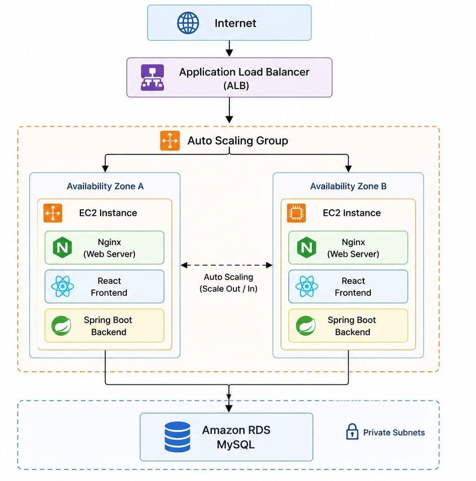
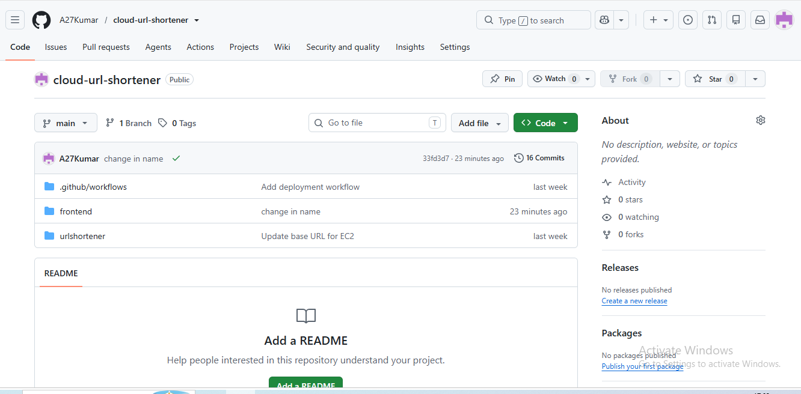
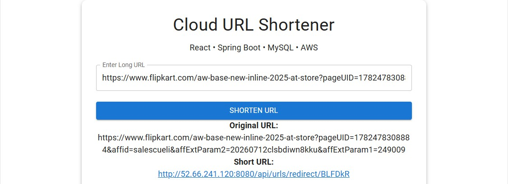
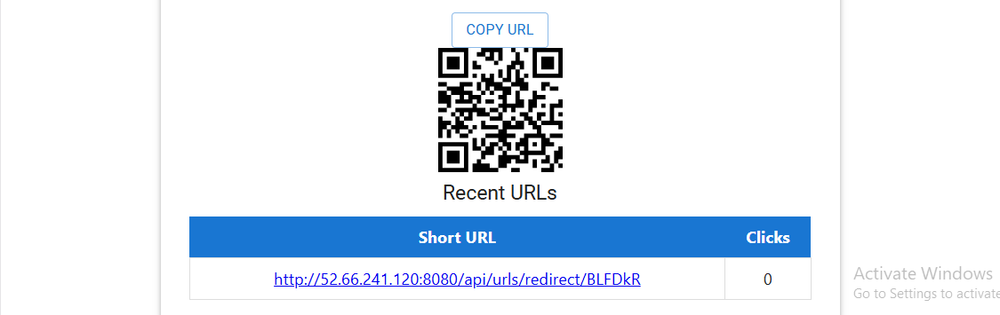
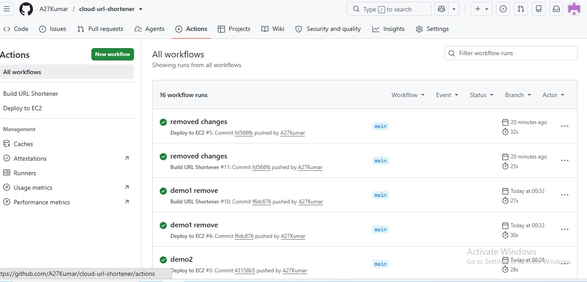
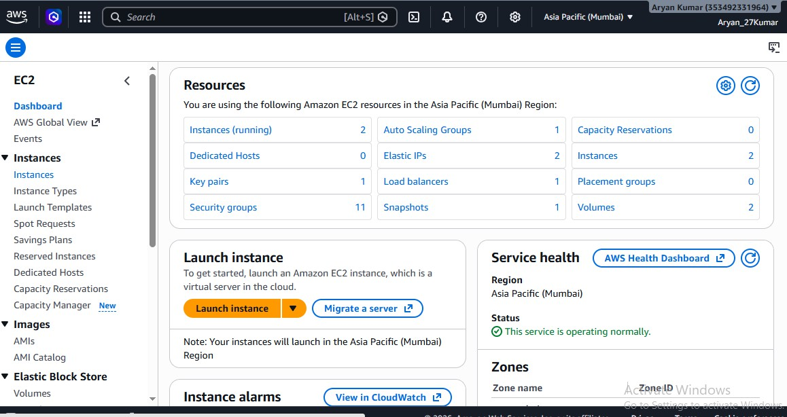

# Cloud URL Shortener

A cloud-based URL Shortener application developed using React, Spring Boot, MySQL, and AWS. The application allows users to generate short URLs, redirect to the original website, and track URL usage. The project is deployed on AWS with an automated CI/CD pipeline using GitHub Actions.

---

## Features

- Shorten long URLs
- Redirect to original URLs
- QR Code generation
- Recent URLs list
- Click counter
- Responsive user interface
- Cloud deployment on AWS
- Automated CI/CD using GitHub Actions

---

## Tech Stack

### Frontend
- React
- Vite
- Material UI

### Backend
- Spring Boot
- Java 21
- Spring Data JPA

### Database
- MySQL (Amazon RDS)

### Cloud & DevOps
- Amazon EC2
- Amazon RDS
- Application Load Balancer
- Auto Scaling Group
- Nginx
- GitHub Actions
- Git

---

# System Architecture



---

# Project Screenshots

## GitHub Repository



---

## Live Application



---

## QR Code & Recent URLs



---

## GitHub Actions



---

## Amazon EC2 Dashboard



---

## Amazon RDS


---

## Spring Boot Backend Running


---

## CI/CD Pipeline

1. Developer pushes code to GitHub.
2. GitHub Actions automatically starts the workflow.
3. Application is built successfully.
4. Deployment to AWS EC2 is triggered.
5. Spring Boot service restarts automatically.
6. Updated application becomes available.

---

## Project Structure

```
cloud-url-shortener
│
├── frontend
├── urlshortener
├── .github
│   └── workflows
├── screenshots
└── README.md
```

---

## Deployment

- Frontend hosted using Nginx on Amazon EC2.
- Backend developed with Spring Boot.
- Database hosted on Amazon RDS MySQL.
- GitHub Actions used for Continuous Integration and Continuous Deployment.

---

## Author

**Aryan Kumar**

B.Tech Computer Science & Engineering

Cloud Computing Vocational Training Project

---

## Note

This project was successfully deployed on AWS Cloud.

The EC2 instance has been stopped after successful project completion to avoid unnecessary AWS charges.
